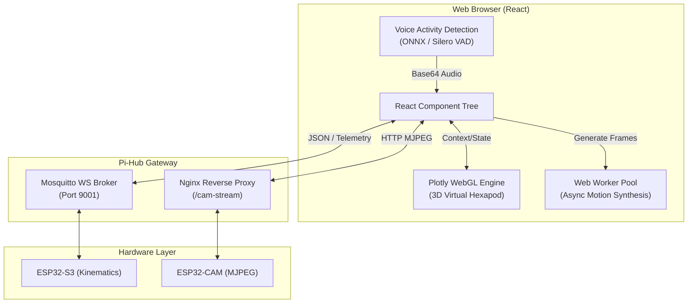
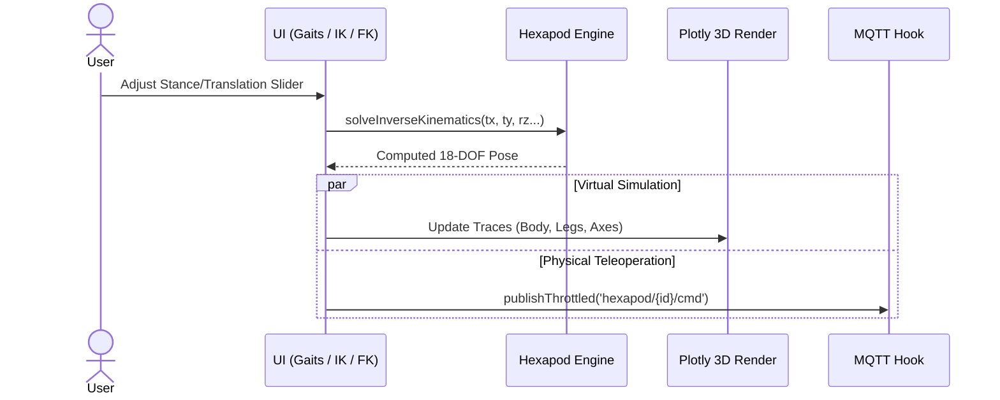
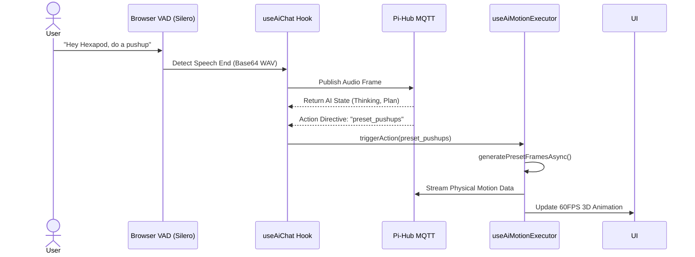

# Hexapod V2 — Web UI & AI Simulator

[](https://developer.mozilla.org/en-US/docs/Web)
[](https://reactjs.org/)
[](https://plotly.com/javascript/)
[](https://mqtt.org/)
[](LICENSE)

The **Hexapod V2 Web UI** is the primary human-machine interface and 3D simulation environment for the Hexapod robotics platform. Building upon Mithi's original "Bare Minimum Hexapod Robot Simulator", this V2 iteration introduces real-time MQTT hardware telemetry, a dual-stage MJPEG camera viewport, a local WebGL kinematics engine, and a fully integrated AI Copilot with browser-based Voice Activity Detection (VAD).

---

## Table of Contents

- [System Architecture](#system-architecture)
- [Core Workflows](#core-workflows)
  - [1. Real-Time Teleoperation & 3D Simulation](#1-real-time-teleoperation--3d-simulation)
  - [2. Smart Speaker & AI Command Execution](#2-smart-speaker--ai-command-execution)
- [UI Modules & Features](#ui-modules--features)
- [Kinematics & Motion Synthesis](#kinematics--motion-synthesis)
- [Directory Structure](#directory-structure)
- [Installation & Development](#installation--development)
- [Credits & Contributors](#credits--contributors)
- [License](#license)

---

## System Architecture

The frontend operates as an offline-capable React application. It uses a unified `RobotContext` to bridge the gap between the virtual 3D rendering engine and the physical robot via a WebSocket-based MQTT client.



---

## Core Workflows

### 1. Real-Time Teleoperation & 3D Simulation
The UI provides immediate visual feedback for Inverse/Forward Kinematics and Gait generation. Adjusting a slider in the browser instantly updates the 3D WebGL plot and throttles a synchronized command stream to the hardware.



### 2. Smart Speaker & AI Command Execution
The Web UI acts as a local smart speaker. Utilizing `@ricky0123/vad-web` and an ONNX runtime directly in the browser, the UI detects speech, buffers it, and relays it to the Pi-Hub AI service for processing, rendering the AI's "thoughts" and actions dynamically.



---

## UI Modules & Features

- **Dual-Stage Viewport:** A split-screen mode combining a live ESP32-CAM MJPEG feed (with connection watchdog and reconnect logic) and the Plotly 3D virtual simulator.
- **Control Hub (Floating FAB):** A draggable, corner-snapping overlay modal containing the AI Chat Terminal, System Logs, Power Controls, and Memory Manager.
- **Kinematics Dashboards:** Dedicated routing pages for calculating and visualizing Forward Kinematics, Inverse Kinematics, and Leg Patterns.
- **AI Task Stepper:** A dynamic UI component that visualizes the LLM's real-time reasoning pipeline (Chain of Thought), tokens-per-second, and step-by-step execution plans.
- **Memory Manager:** A visual interface to inspect and modify the robot's context pool (Session vs. Persistent memory).

---

## Kinematics & Motion Synthesis

To prevent the React main thread from blocking during complex gait calculations, the UI utilizes a highly optimized kinematic solver and Web Worker pool:

1. **Virtual Hexapod Core:** Analytically computes 6-DOF body orientations, center-of-gravity projections, and foot-tip intersection geometry (`VirtualHexapod.js`, `LinkageIKSolver.js`).
2. **Motion Interpolation:** Calculates continuous bezier/quintic trajectories between poses (`interpolation.js`).
3. **Web Worker Offloading:** Complex multi-cycle dynamic sequences (e.g., dance, cheer, wave) are piped into a background `Worker`, returning a high-framerate pose array for the 3D visualizer without stuttering the browser (`workerPool.js`).
4. **Omnidirectional Walk Sequence Solver:** Generates discrete tripod and ripple gait paths supporting variable hip swing, lift height, and body stances (`walkSequenceSolver.js`).

---

## Directory Structure

```text
web-ui/
├── public/                 # Static assets, manifests, and index.html
├── scripts/                # Build analyzers (Webpack Bundle Analyzer)
├── src/
│   ├── components/         # Reusable React UI Components
│   │   ├── ai/             # Chat terminal, Action Grids, Status bars
│   │   ├── camera/         # MJPEG Streamer and Offline placeholders
│   │   ├── generic/        # Sliders, Toggle Switches, Number Inputs
│   │   ├── hub/            # Floating Draggable Control Modal
│   │   ├── pages/          # Full-screen routes (IK, FK, Gaits, AI Panel)
│   │   └── viewport/       # 3D Plotly integration & view toggles
│   ├── context/            # React Context (RobotProvider)
│   ├── hexapod/            # Core Mathematics & Geometry Engine
│   │   ├── solvers/        # IK/FK Solvers & Web Worker Motion Synthesis
│   │   ├── Hexagon.js      # Body mesh calculations
│   │   ├── Linkage.js      # Leg geometry matrices
│   │   └── Vector.js       # 3D Vector math
│   ├── hooks/              # Custom React Hooks
│   │   ├── useAiChat.js    # AI state management & MQTT mapping
│   │   ├── useMqtt.js      # Core Websocket MQTT connection loop
│   │   └── useVoiceRecorder.js # ONNX/VAD audio processor
│   ├── styles/             # Tailwind CSS configurations
│   ├── templates/          # Default Hardware dimensions & Plotly settings
│   └── utils/              # Network discovery, Audio manipulation, Action parsing
└── package.json            # Node dependencies
```

---

## Installation & Development

This project was bootstrapped with Create React App and heavily leverages modern React Hooks.

### Prerequisites
- **Node.js**: v14.x or v16.x recommended.
- **Yarn or npm**.

### Setup Instructions

1. **Install Dependencies:**
   ```bash
   cd web-ui
   npm install
   ```

2. **Build Tailwind CSS (Optional/Dev):**
   ```bash
   npm run tailwind:build
   # Or run the watcher in a separate terminal: npm run tailwind:watch
   ```

3. **Start Development Server:**
   ```bash
   npm start
   ```
   *Note: If you encounter OpenSSL errors on newer Node versions, the `package.json` already has `cross-env NODE_OPTIONS=--openssl-legacy-provider` to ensure compatibility.*

4. **Production Build:**
   ```bash
   npm run build
   ```

5. **Run Test Suite:**
   ```bash
   npm test
   ```
   *(Includes Jest assertions for Kinematics, Web Workers, and React DOM trees).*

---

## Credits & Contributors

This UI and physics engine builds heavily upon the foundation set by Mithi's [Bare Minimum Hexapod Robot Simulator](https://github.com/mithi/hexapod). 

A huge thank you to the original creator and the open-source contributors whose efforts shaped the core math, visualization, and tooling of this project:

*   **[@mithi](https://github.com/mithi)**
*   **[@dependabot[bot]](https://github.com/dependabot)**
*   **[@icyJoseph](https://github.com/icyJoseph)**
*   **[@mikong](https://github.com/mikong)**
*   **[@2Shar18](https://github.com/2Shar18)**
*   **[@nitesh-sharma-01](https://github.com/nitesh-sharma-01)**

---

## License

This project is licensed under the Apache License 2.0 License. See the [LICENSE](LICENSE) file for complete details.