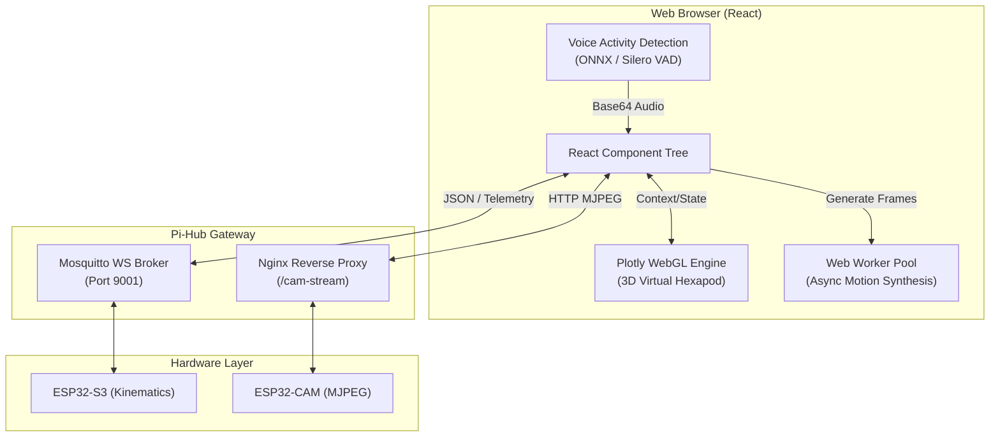
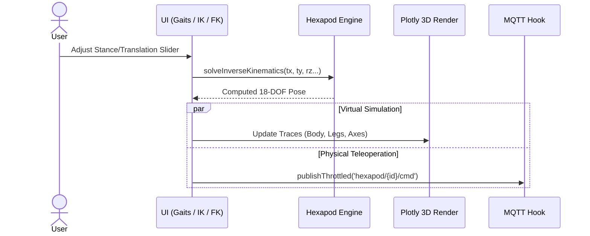
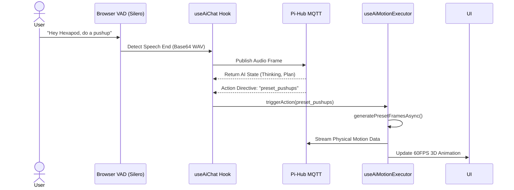

# Hexapod V2 — Web UI & AI Simulator

[](https://developer.mozilla.org/en-US/docs/Web)
[](https://reactjs.org/)
[](https://plotly.com/javascript/)
[](https://mqtt.org/)
[](LICENSE)

The **Hexapod V2 Web UI** is the primary human-machine interface and 3D simulation environment for the Hexapod robotics platform. Building upon Mithi's original *Bare Minimum Hexapod Robot Simulator*, this V2 iteration introduces real-time MQTT hardware telemetry, a dual-stage MJPEG camera viewport, a local WebGL kinematics engine, and an integrated AI Copilot with browser-based Voice Activity Detection (VAD).

---

## Table of Contents

- [System Architecture](#system-architecture)
- [Core Workflows](#core-workflows)
  - [1. Real-Time Teleoperation & 3D Simulation](#1-real-time-teleoperation--3d-simulation)
  - [2. Smart Speaker & AI Command Execution](#2-smart-speaker--ai-command-execution)
- [UI Modules & Capabilities](#ui-modules--capabilities)
- [Kinematics & Motion Synthesis](#kinematics--motion-synthesis)
- [Directory Structure](#directory-structure)
- [Installation & Development](#installation--development)
- [Configuration Defaults](#configuration-defaults)
- [Credits & Contributors](#credits--contributors)
- [License](#license)

---

## System Architecture

The frontend operates as an offline-capable React application. It uses a unified `RobotContext` to bridge the gap between the virtual 3D rendering engine and the physical robot via a WebSocket-based MQTT client.



---

## Core Workflows

### 1. Real-Time Teleoperation & 3D Simulation
The UI provides immediate visual feedback for Inverse/Forward Kinematics and Gait generation. Adjusting a slider in the browser updates the 3D WebGL plot and throttles a synchronized command stream to the hardware.



### 2. Smart Speaker & AI Command Execution
The Web UI functions as a local smart speaker. Utilizing `@ricky0123/vad-web` and an ONNX runtime directly in the browser, the UI detects speech, buffers it, and relays it to the Pi-Hub AI service for processing.



---

## UI Modules & Capabilities

* **Dual-Stage Viewport** — Split-screen interface pairing a live ESP32-CAM MJPEG feed (with automatic reconnection watchdog) alongside the Plotly 3D virtual simulator.
* **Control Hub (Floating Overlay)** — Draggable, corner-snapping overlay containing the AI Chat Terminal, System Logs, Power Controls, and Memory Manager.
* **Kinematics Dashboards** — Dedicated route views for computing and inspecting Forward Kinematics, Inverse Kinematics, and Custom Leg Patterns.
* **AI Task Stepper** — Live pipeline visualizer exposing the LLM's chain-of-thought reasoning, token throughput, and step execution progress.
* **Memory Manager** — Visual inspector to examine and mutate session-level and persistent robot context parameters.

---

## Kinematics & Motion Synthesis

To prevent the React main thread from blocking during high-frequency calculations, motion synthesis is decoupled into a dedicated Web Worker pool:

1. **Virtual Hexapod Core:** Analytically calculates 6-DOF body orientations, center-of-gravity projections, and foot-tip intersection geometry (`VirtualHexapod.js`, `LinkageIKSolver.js`).
2. **Motion Interpolation:** Generates continuous quintic and Bézier trajectories between distinct kinematic poses (`interpolation.js`).
3. **Web Worker Offloading:** Multi-cycle dynamic sequences (such as complex gaits and dances) are offloaded to background threads, delivering 60 FPS pose arrays without UI latency (`workerPool.js`).
4. **Omnidirectional Gait Solver:** Resolves discrete tripod and ripple gait paths with configurable hip swing, clearance height, and base stance dimensions (`walkSequenceSolver.js`).

---

## Directory Structure

```text
web-ui/
├── public/                 # Static assets, manifests, and HTML shell
├── scripts/                # Webpack bundle analyzers and build utilities
├── src/
│   ├── components/         # Modular React components
│   │   ├── ai/             # Chat terminal, Action Grids, Status bars
│   │   ├── camera/         # MJPEG Streamer and fallback views
│   │   ├── generic/        # Sliders, Toggle Switches, Number Inputs
│   │   ├── hub/            # Floating Draggable Control Modal
│   │   ├── pages/          # Full-screen routes (IK, FK, Gaits, AI Panel)
│   │   └── viewport/       # Plotly 3D integration & canvas controls
│   ├── context/            # React Context stores (RobotProvider)
│   ├── hexapod/            # Kinematic equations & geometric models
│   │   ├── solvers/        # IK/FK solvers and Web Worker motion engines
│   │   ├── Hexagon.js      # Chassis mesh calculations
│   │   ├── Linkage.js      # Leg geometry transformation matrices
│   │   └── Vector.js       # 3D Vector math utilities
│   ├── hooks/              # Custom React Hooks
│   │   ├── useAiChat.js    # AI state management & telemetry mapping
│   │   ├── useMqtt.js      # WebSocket MQTT connection lifecycle
│   │   └── useVoiceRecorder.js # ONNX/VAD audio capture pipeline
│   ├── styles/             # Tailwind CSS stylesheets and design tokens
│   ├── templates/          # Default chassis dimensions & Plotly scene configs
│   └── utils/              # Network discovery, audio parsing, action registries
└── package.json            # Manifest and dependencies
```

---

## Installation & Development

### Prerequisites
* **Node.js**: v14.x or v16.x recommended.
* **Package Manager**: npm or yarn.

### Setup Instructions

1. **Install dependencies:**
   ```bash
   cd web-ui
   npm install
   ```

2. **Build Tailwind CSS assets:**
   ```bash
   npm run tailwind:build
   # Watch mode: npm run tailwind:watch
   ```

3. **Start local development server:**
   ```bash
   npm start
   ```

> [!NOTE]
> On newer Node.js runtimes (Node 17+), legacy OpenSSL encryption flags are required. The repository includes `cross-env NODE_OPTIONS=--openssl-legacy-provider` inside `package.json` to handle this automatically.

4. **Compile production build:**
   ```bash
   npm run build
   ```

5. **Execute test suite:**
   ```bash
   npm test
   ```

---

## Configuration Defaults

When hosting externally (such as Netlify or GitHub Pages) or connecting to custom hardware, configure runtime parameters in the following target files:

* **`src/utils/networkConfig.js`**  
  Configures default MQTT broker hostnames (`spider-w.local`), WebSocket ports (`9001`), and reverse proxy pathways for the MJPEG video stream.
* **`src/hooks/useMqtt.js`**  
  Sets default client device identifiers (`hexapod-s3-01` and `hexapod-cam-01`). Can be overridden dynamically using URL search parameters (e.g., `?device=my-robot&cam=my-cam`).
* **`src/templates/hexapodParams.js`**  
  Defines mechanical link lengths (coxa, femur, tibia) and initial home stance offsets.
* **`src/constants/aiActions.json`**  
  The centralized action schema mapping voice keywords, duration limits, and inverse kinematic matrices.

---

## Credits & Contributors

This interface builds upon the core simulation framework created by Mithi in the [Bare Minimum Hexapod Robot Simulator](https://github.com/mithi/hexapod).

* [@mithi](https://github.com/mithi)
* [@dependabot[bot]](https://github.com/dependabot)
* [@icyJoseph](https://github.com/icyJoseph)
* [@mikong](https://github.com/mikong)
* [@2Shar18](https://github.com/2Shar18)
* [@nitesh-sharma-01](https://github.com/nitesh-sharma-01)

---

## License

This project is distributed under the Apache License 2.0. See the [LICENSE](LICENSE) file for complete details.